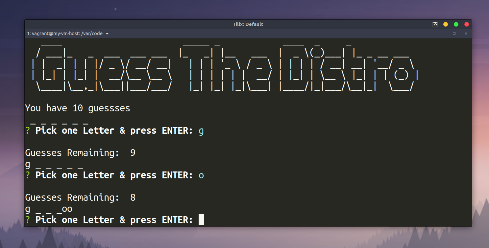

# Constructor Word - Guess for Command line Interface

### A node.js application that takes a random word from an array of words, and then user then guesses one letter at a time to guess the word!
#### Theme: Linux distrobutions

# How to install & Play
* clone repo & open up your CLI of choice
* Run NPM Install
* then run command _node index.js_ to begin!

# Technologies used
* Node.js
* Javascript
* NPM install - Inquirer
* NPM install - figlet 

FYI -> As of Friday 4/37 game bugs haven't been worked out.